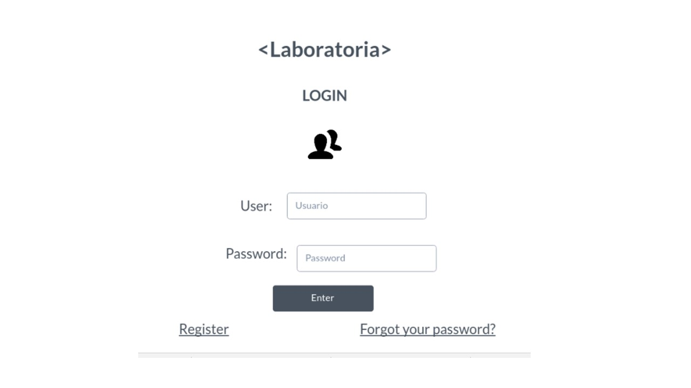
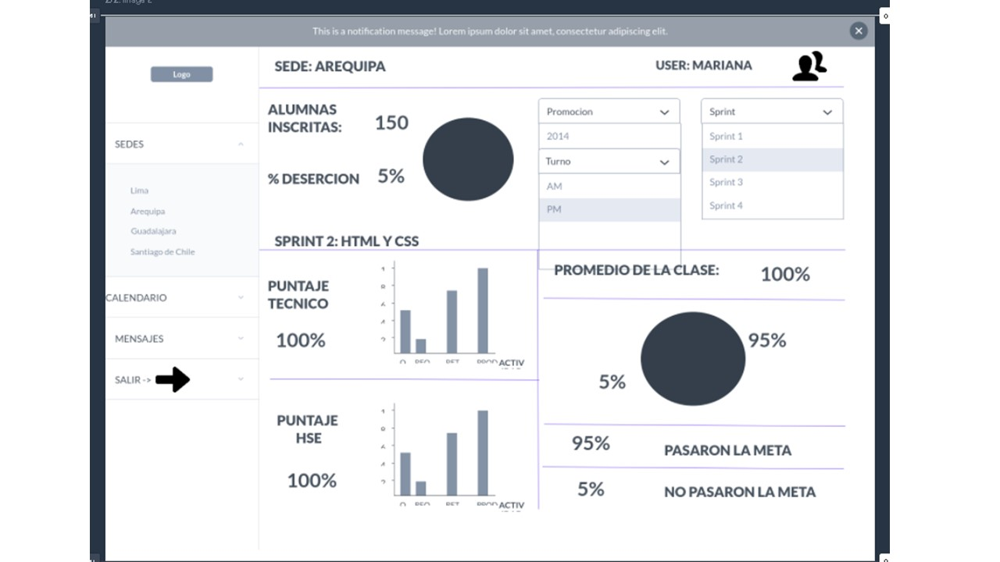

# Dashboard de Laboratoria
_____________

El dashboard es una herramienta utilizada por profesores, training managers, directores y gerentes de Laboratoria para ver rápidamente qué está pasando en el salón de clases de Laboratoria. En el dashboard, los usuarios mencionados pueden ver rápidamente estadísticas y datos en tiempo real como:

*# de alumnas inscritas
*# de alumnas que desertaron
*# y % de alumnas que pasan el criterio mínimo de evaluación
*Promedio de notas por sprint
*Promedio de notas HSE
*Promedio de notas técnicas

La primera ventana consta del logueo con un usuario y password

En la segunda ventana podemos observar todas las funcionalidades requeridas para el dashboard

## Detalles adicionales
-Para esta aplicación se empleó Marvel y pueden observar el dashboard online en https://marvelapp.com/5913j6g

  
  Cualquier consulta, duda o sugerencia puede realizarla al correo: adayc@hotmail.com
